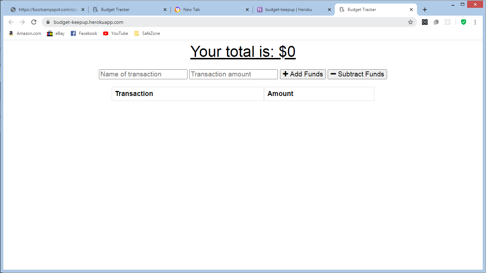

#budget-pwq

BCS bootcamp assignment was to turn a budget tracker app
to work and update data to robo 3t offline.

basic function of the app. The user is able to add funds to the app and the app would automatic show the user a graph of the comming income and sepending.
one can test the app by going to the app console going to network and selecting the offline on the drop down menue options
Some of the bugs in the app the data does not store in in database just in catch.

 
 
 created a webmanifest file and indexDB file and linked them to the index.html. By clearing catch and hardreload confirm both instance of maifest and index.db were created in my application console.
  
  

  
[this is the link to the page](https://budget-keepup.herokuapp.com/)
